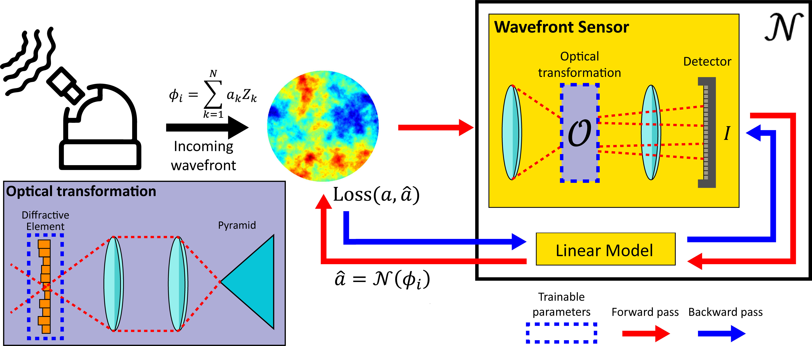

# End2EndPyrWFS
Official implementation for "[Deep Optics Preconditioner for Modulation-free Pyramid Wavefront Sensing](https://preprints.opticaopen.org/articles/preprint/Deep_Optics_Preconditioner_for_Modulation-free_Pyramid_Wavefront_Sensing/23812041)"



# Requirements

* Python 3.9
* Pytorch >=1.10+
* Numpy
* Scikit-image
* Scikit-learn
* tqdm
* scipy
* mpmath
* tensorboard

# Installation
- install anaconda (https://www.anaconda.com/products/distribution)
- on anaconda prompt (windows) or terminal (linux) create enviroment:
```
conda create -n dpwfs python=3.9
conda activate dpwfs
```
- Install pytorch + cuda:
```
conda install pytorch==1.10.1 torchvision==0.11.2 torchaudio==0.10.1 cudatoolkit=10.2 -c pytorch
```

# Description
This repository contains two main codes. The MATLAB code includes the basic functions extracted from [OOMAO](https://github.com/rconan/OOMAO), which are used for the analysis of results.
To train a diffractive element, we have also provided an implementation of the same equations in PyTorch.

## HowTo

- You must first generate data using the generators provided in the pytorch folder.

  Example for modulation 0, resolution 128 and get 35 Zernike decomposition of each phasemap:

  ```
  python DataGeneratorCuda.py --modulation 0 --samp 2 --D 8 --nPxPup 128 --zModes [2,36]

  ```
  by default the script create 100 training phases and zernike decompositions and 10 for validation. 
  
- Then for training you have to use the same parameters generated:

  ```
  python E2E_main.py --modulation 0 --samp 2 --D 8 --nPxPup 128 --zModes [2,36] --batchSize 1

  ```
  
  check the E2E_main script parser help for extra parameters like noise and pyramid shape. If more GPU's are available, you can use ``` --gpu 0,1,N ``` to load the process with data paralelization, or run mutiple instances on each GPU.

When a training instance is run, the results are saved in ```./train_results/"expname"/```. You can set up the experiment name with ```--experimentName```. In this folder, the following parameters are saved:
- checkpoints: Those are the model saved as a pytorch module (epoch_n.pth) for each epoc during training, with this file you can resume the training by seting up the path in ``` --checkpoint ```.
- DE: This folder contains the trained Diffractive Element on each epoch. The file is a .mat format that can be loaded into python as a double matrix or in python with scipy librarie.
- validation_results: Here the estimation of the model fo the validation dataset is stored in .mat format.

## Tensorboard monitoring
Additionaly, on ```./train_results/``` a extra folder is created called ```tensorboard_summary/```. This folder contain metric results, DE as images of each Epoch and estimation examples of each experiment you run. To monitor tensorboard you have to run the following command on a terminal:

  ```
  tensorboard --logdir=train_results/tensorboard_summary

  ```
the folowwing output should apeear on the comand prompt:

 ```
NOTE: Using experimental fast data loading logic. To disable, pass
    "--load_fast=false" and report issues on GitHub. More details:
    https://github.com/tensorflow/tensorboard/issues/4784

Serving TensorBoard on localhost; to expose to the network, use a proxy or pass --bind_all
TensorBoard 2.6.0 at http://localhost:6006/ (Press CTRL+C to quit)  
 ```
the just enter ```http://localhost:6006/``` to check the results.

# Reproducing Results
All the figures generated in the research paper were obtained using the scripts in the MATLAB folder. Please ensure that you set up the path to the Diffractive Element (saved as a .mat file) in the first lines of each script you wish to run. Here is a list of available figures that can be reproduced:

```
Paper_Fig4.m
Paper_Fig5_6.m
Paper_Fig7_8.m
Paper_Fig9.m
Paper_Fig10.m
Paper_Fig12.m
```
However it is highly recommended to use python scripts for figures 5, 7, 9 and 10 on ```Detach_OOMAO/Pytorch/figure_calculators/``` to compute the results and then using the MATLAB scripts to plot the figures.

# Citation
If you find our project useful, please cite:

```
@article{guzman2024deep,
  title={Deep optics preconditioner for modulation-free pyramid wavefront sensing},
  author={Guzm{\'a}n, Felipe and Tapia, Jorge and Weinberger, Camilo and Hern{\'a}ndez, Nicol{\'a}s and Bacca, Jorge and Neichel, Benoit and Vera, Esteban},
  journal={Photonics Research},
  volume={12},
  number={2},
  pages={301--312},
  year={2024},
  publisher={Optica Publishing Group}
}
```

# Contact
You can contact Felipe Guzman by sending mail to felipe.guzman.v@mail.pucv.cl
